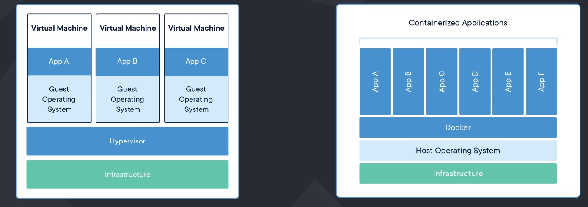

# Introdução ao Docker

## O que são containers?

<br>

"Um container é uma unidade padronizada de software que empacota o código e todas as suas dependências para que um software seja executado de forma rápida e consistente em qualquer ambiente."

<br>

Principais Características:

- Imutabilidade
- Isolamente de processos e recursos computacionais
- Leves - É executado com um processo no sistema operacional.
- Utilizam os recursos do Kernel do SO - Não possui a necessidade de instalar um novo SO
- Rápido de iniciar e de ser removido ou parado - Não há necessidade de 'boot'
- Utilizam "Imagens" (imutáveis) para serem executados - Algo similar a um snapshot
- Linux é rei
- Resolve o famoso "Na minha máquina funciona"

<br>

## Containers vs Máquinas Virtuais



## Docker no CMD

```sh
# run executa um container, e depois passa-se o nome da imagem, no caso, hello-world
docker run hello-world

# Mostra os container em execução
docker ps

# Mostra todos os containers que temos, independente se estão sendo executados ou não
docker ps -a

# Toda vez que se usa o comando run cria-se uma nova imagem, mesmo usando a mesma imagem
docker run --name mycontainer hello-world

# Para descobrir comandos como o --name acima, podemos executar
docker run --help
# Com o comando abaixo filtra-se apenas os que tem a palavra "name"
docker run --help | grep name

# Para facilitar a visualização podemos usar um sinal de "=" em cada parâmetro
docker run --name=mycontainer hello-world

# Para remover um container, ele deve estar "saido" ou parado, não é possível remover um container em execução
docker rm ID_DO_CONTAINER
# Ou
docker rm NOME_DO_CONTAINER

# Para parar um container
docker stop NOME_DO_CONTAINER

# Para iniciar um container
docker start NOME_DO_CONTAINER

# Para remover um container em execução
docker rm -f NOME_DO_CONTAINER

# Para rodar um container em segundo plano usa-se o comando abaixo, -d significa dettached, "desemprende" do terminal
docker run -d nginx

# Para prender um terminal em um container, usa-se
docker attach ID_DO_CONTAINER

# Para executar comandos dentro de um container, podemos utilizar os comandos abaixo, no primeiro exemplo estamos executando o comando "ls" dentro do container
docker exec NOME_DO_CONTAINER ls

# Para "entrar" no terminal dentro do container
docker exec -it ID_DO_CONTAINER bash

# Para o container se autoremover quando parado ou "saido"
docker run --rm nginx

# Para remover multíplos containers, usamos um subcomando
docker rm -f $(docker ps -a -q)

# Para expor uma porta usa-se o comando abaixo, basicamente está dizendo "pegue a porta 80 do container e mapeie-a para a minha porta 8080"
docker run -p 8080:80 nginx
```
